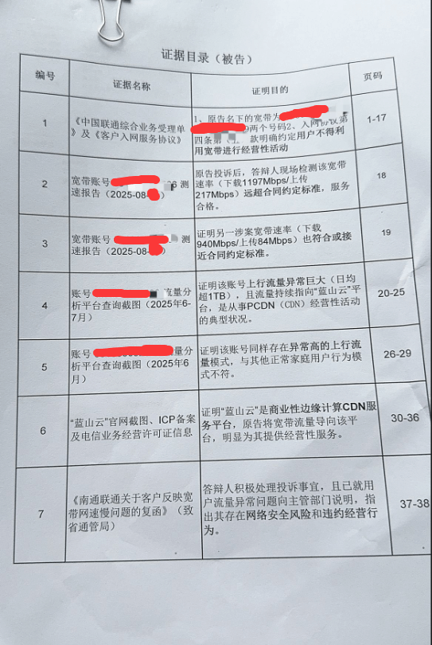
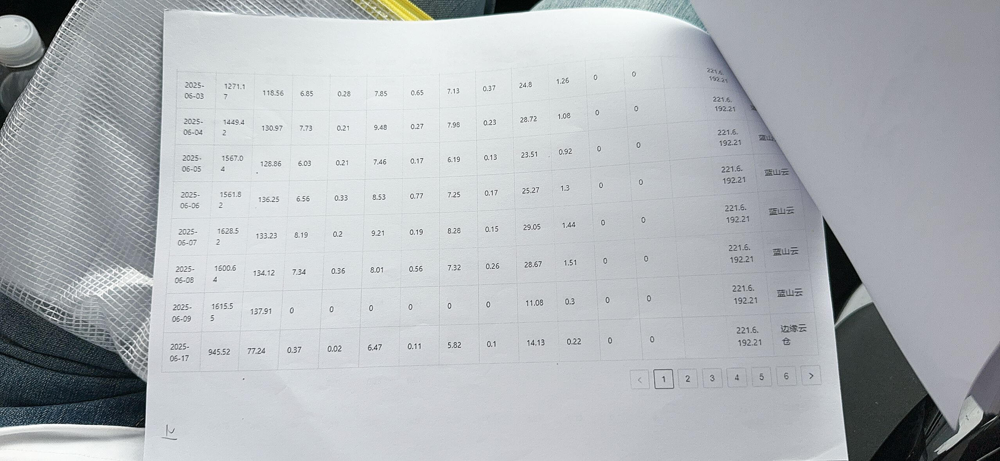

江苏联通在应诉某案件时，提交的证据里面，已逐条列举出自身对公民隐私的侵犯行为。

当一家公司堂而皇之地站在法庭上，将其对公民私人通信的监控数据作为证据提交时，这已不仅是一起普通的商业纠纷，而是对宪法尊严的公开践踏，是对法治文明的公然强暴！

我国宪法第四十条白纸黑字、庄严明确规定：**​​中华人民共和国公民的通信自由和通信秘密受法律的保护​**。这一庄严条款是公民基本权利的基石。而作为被依法授权提供通信服务的运营商，其核心义务本是保障这一基本权利，而非反过来成为最危险的侵害者。江苏联通的行为，是对其法定职责的彻底背叛。

更为严重的是，根据《中华人民共和国刑法》第二百五十三条之一的规定，**窃取或者以其他方法非法获取公民个人信息的**，构成犯罪；单位犯前三款罪的，对单位判处罚金，并对其直接负责的主管人员和其他直接责任人员，依照各该款的规定处罚。
公民的通信内容，无疑是最为敏感和核心的个人信息。运营商在无明确、法定授权且未经用户同意的情况下，系统性监控并获取通信内容，其行为性质已完全符合该罪名的构成要件，涉嫌刑事犯罪。

然而，最令人感到震惊与愤怒的是，此案揭开的仅是冰山一角。事实上，**​​全国各地的电信运营商，为了追逐商业利益，已将无差别的通信监控视为一种“标准操作”**。​​ 这意味着，亿万用户的网络活动，时刻处于运营商的窥探之下。一个本应恪守中立、保障通信管道的服务商，竟系统性、普遍性地异化为公民隐私的窥视者。

然而，如此普遍且猖獗的犯罪行为，何以能长期存在？​**​监管部门的系统性渎职难辞其咎**。​​行业主管部门本应是守护行业合规的第一道防线，却对这般大规模的违宪违法犯罪现象视而不见、监管乏力，这无异于纵容。这种不作为，不仅是行政怠惰，更可能涉嫌​​玩忽职守罪​​等渎职犯罪。监管的“沉睡”与“缺席”，是运营商敢于将非法监控“常态化”的重要外部条件。

这种行为，是​​三重意义上的堕落​​：

1. ​​法治的堕落：​​ 运营商作为关键信息基础设施的运营者，本应是依法经营的典范，却成了宪法的直接违反者。
2. ​​信用的堕落：​​ 用户基于信任将通信秘密托付于运营商，而后者却将这份信任肆意出卖，行业伦理荡然无存。
3. ​​监管的堕落：​​ 如此大规模、普遍性的违法行为能够存在，暴露出行业监管的严重滞后与失灵。

从江苏联通的“个别展示”到全国范围的“普遍存在”，这已不是一个公司的个案违法，而是​**​整个行业陷入的一场系统性、制度性的违宪违法危机​**​。

 
